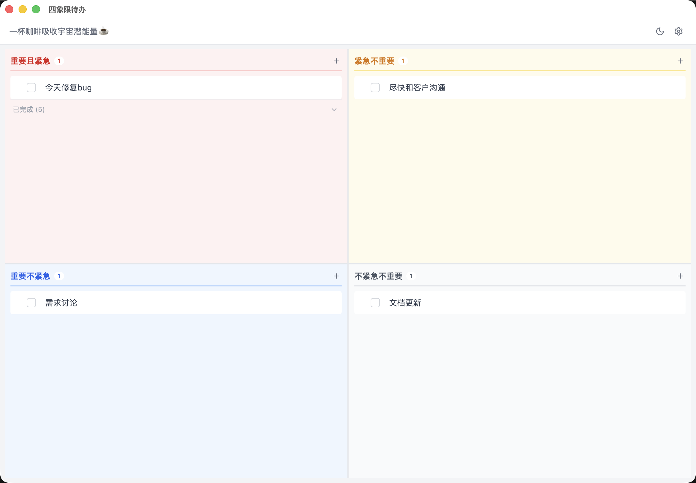

# QuadTodo

简洁的四象限待办事项应用。



## 核心理念

将待办事项按「紧急程度」和「重要程度」分为四个象限，帮助你更清晰地管理任务：

| 象限 | 特征 | 行动 |
|------|------|------|
| 第一象限 | 重要且紧急 | 立即处理 |
| 第二象限 | 紧急不重要 | 委托他人 |
| 第三象限 | 重要不紧急 | 计划安排 |
| 第四象限 | 不紧急不重要 | 尽量避免 |

## 功能特点

- **四象限分类**：通过艾森豪威尔矩阵理清任务优先级
- **拖拽排序**：在象限内或跨象限拖拽调整任务顺序和分类
- **完成任务**：勾选标记任务完成状态，可隐藏已完成任务保持界面整洁
- **待办详情**：为待办事项添加 Markdown 笔记，记录更多细节
- **暗色模式**：支持深色主题，适配不同使用环境
- **本地存储**：数据保存在浏览器本地，无须登录，开箱即用
- **桌面端支持**：提供 macOS、Windows、Linux 桌面应用

## 使用说明

### 添加待办

在任意象限点击「+」按钮或按 Enter 键即可新建待办事项。

### 编辑待办

- 点击待办项直接编辑内容
- 清空内容后自动删除该待办项

### 移动待办

拖拽待办项在不同象限间移动，自动更新其分类。

### 查看详情

点击待办项右侧的文档图标打开详情面板，用 Markdown 记录任务相关信息。

### 主题切换

点击右上角设置按钮，可切换深色/浅色模式。

## 快速上手

```bash
# 安装依赖
npm install

# 启动开发服务器
npm run dev

# 构建生产版本
npm run build

# 生成应用图标（需要先放置 1024x1024 的 icon.png）
npm run icons:generate

# 构建桌面端应用
npm run tauri:build

# 一键生成图标并构建（桌面端）
npm run tauri:build:full
```

### 图标准备

在 `src-tauri/icons/` 目录下放置 `icon.png`（1024x1024 像素），运行图标生成命令后即可构建桌面端。

## 获取应用

### 网页版

直接访问部署地址即可使用。

### 桌面端

从 [Releases](https://github.com/your-repo/releases) 下载对应平台的安装包：

- macOS：`.dmg` 安装包
- Windows：`.msi` 安装包
- Linux：`.AppImage` 或 `.deb` 包

## 快捷键

- `Enter`：确认编辑
- `Esc`：清空内容（内容为空时删除该待办）
- `Tab`：切换到下一个待办项

---

「日拱一卒，功不唐捐」
